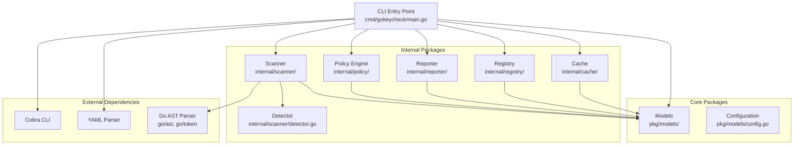

# GoKeyCheck Architecture Overview

## System Overview

GoKeyCheck is designed as a modular, extensible system for analyzing Flutter widget keys. The architecture follows Go best practices with clean separation of concerns and well-defined interfaces.

## Architecture Diagram



## Component Responsibilities

### CLI Entry Point (`cmd/gokeycheck/`)
- **Purpose**: Command-line interface and application orchestration
- **Responsibilities**:
  - Parse command-line arguments using Cobra
  - Load and validate configuration
  - Coordinate component interactions
  - Handle errors and user feedback
  - Signal handling and graceful shutdown

### Models Package (`pkg/models/`)
- **Purpose**: Core data structures and domain models
- **Key Types**:
  - `KeyInfo`: Represents a detected Flutter key with metadata
  - `ScanResult`: Contains results of a complete scan operation
  - `Config`: Application configuration structure
  - `ValidationStatus`: Validation state and error information
- **Design Principles**:
  - Immutable where possible
  - JSON/YAML serialization support
  - Strong typing for safety

### Scanner Package (`internal/scanner/`)
- **Purpose**: Flutter key detection from Dart source files
- **Components**:
  - `Scanner`: Main scanning orchestrator
  - `Detector`: Pattern matching and key extraction
- **Features**:
  - Parallel file processing
  - Context cancellation support
  - Regex-based pattern detection (placeholder for Dart AST)
  - Source code snippet extraction

### Policy Engine (`internal/policy/`)
- **Purpose**: Validation rules and policy enforcement
- **Policy Types**:
  - Required Keys: Enforce key usage on specific widgets
  - Naming Conventions: Validate key naming patterns
  - Uniqueness: Ensure key uniqueness within scopes
  - Performance: Detect performance anti-patterns
- **Features**:
  - Configurable severity levels
  - Custom rule expressions
  - Conditional policy application

### Reporter Package (`internal/reporter/`)
- **Purpose**: Generate formatted reports from scan results
- **Supported Formats**:
  - JSON: Structured data for API consumption
  - YAML: Human-readable structured format
  - HTML: Rich web-based reports with styling
  - CSV: Tabular data for spreadsheet analysis
  - Text: Plain text summary reports
- **Features**:
  - Template customization
  - Responsive HTML design
  - Code snippet inclusion

### Registry Package (`internal/registry/`)
- **Purpose**: Key storage, indexing, and querying
- **Features**:
  - In-memory key storage with fast lookups
  - Querying by type, name, file, widget
  - Duplicate detection across different scopes
  - Statistics generation
  - Persistence to JSON index files

### Cache Package (`internal/cache/`)
- **Purpose**: Performance optimization through result caching
- **Features**:
  - File-based caching with TTL
  - File hash validation for cache invalidation
  - Size-based cleanup policies
  - Cache statistics and monitoring
  - Multiple key generation strategies

## Key Interfaces

```go
// Core scanner interface
type Scanner interface {
    Scan(ctx context.Context, target string) (*models.ScanResult, error)
}

// Key detection interface  
type Detector interface {
    DetectKeysFromSource(filePath, source string) ([]models.KeyInfo, error)
    ValidateKeyName(name string) []models.ValidationError
}

// Policy validation interface
type PolicyEngine interface {
    ValidateKeys(keys []models.KeyInfo) []models.PolicyResult
    ApplyValidation(keys []models.KeyInfo, results []models.PolicyResult)
}

// Report generation interface
type Reporter interface {
    GenerateReport(result *models.ScanResult, format models.ReportFormat, outputPath string) error
}
```

## Configuration System

The configuration system provides flexible, hierarchical configuration management:

```yaml
# .keycheck.yaml example
scanner:
  include: ["**/*.dart"]
  exclude: ["**/*.g.dart", "**/build/**"]
  parallel:
    enabled: true
    workers: 0  # auto-detect

policies:
  required_keys:
    - name: "ListView requires keys"
      widgets: ["ListView", "ListView.builder"]
      severity: "warning"
  
  naming_conventions:
    - name: "Camel case keys"  
      pattern: "^[a-z][a-zA-Z0-9]*Key$"
      severity: "warning"

reporter:
  default_format: "json"
  include_snippets: true
  
cache:
  enabled: true
  directory: ".gokeycheck_cache"
  ttl: 3600
```

## Extension Points

### Adding New Policy Types
1. Define policy structure in `models/config.go`
2. Implement validation logic in `policy/engine.go`
3. Add configuration examples
4. Write comprehensive tests

### Supporting New Report Formats
1. Add format constant to `models/types.go`
2. Implement generator method in `reporter/reporter.go`
3. Add template support if needed
4. Update CLI help and documentation

### Custom Key Detection
1. Extend `Detector` with new pattern matching
2. Add new key types to `models/types.go`
3. Update validation rules to handle new types
4. Ensure backward compatibility

## Build and Test Structure

```
gokeycheck/
├── Makefile                 # Build automation
├── Dockerfile              # Container support
├── .keycheck.yaml         # Default configuration
├── go.mod, go.sum         # Go modules
├── cmd/gokeycheck/        # CLI entry point
├── pkg/models/            # Public API models
├── internal/              # Private implementation
│   ├── scanner/          # Key detection
│   ├── policy/           # Validation engine  
│   ├── reporter/         # Report generation
│   ├── registry/         # Key storage
│   └── cache/            # Performance caching
├── docs/                  # Documentation
├── testdata/             # Test fixtures
└── examples/             # Usage examples
```

## Future Enhancements

### Dart AST Integration
- Replace regex matching with proper Dart AST parsing
- More accurate context detection  
- Better widget hierarchy analysis

### IDE Integration
- Language server protocol support
- Real-time validation as code is written
- Quick fixes and refactoring suggestions

### Advanced Analytics
- Key usage pattern analysis
- Performance impact modeling
- Trend analysis over time

### Plugin Architecture
- Custom validation rules via plugins
- Third-party report format extensions
- Custom key pattern detection