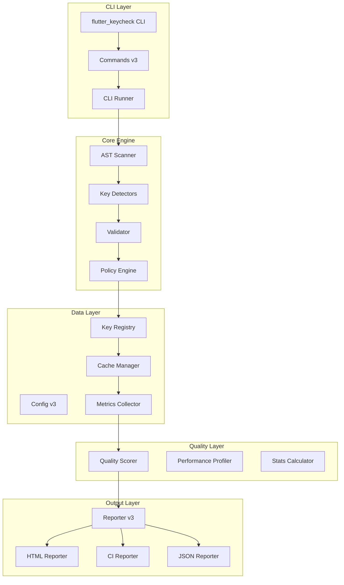

# Flutter KeyCheck v3 - BMAD Architecture

## 🏗️ System Architecture



## 📦 Component Architecture

### 1. CLI Layer (Entry Point)
```
bin/flutter_keycheck.dart
└── lib/src/cli/cli_runner.dart
    ├── commands/scan_command_v3.dart
    ├── commands/validate_command_v3.dart
    └── commands/base_command_v3.dart
```

### 2. Core Engine (Processing)
```
lib/src/
├── ast_scanner.dart         # AST parsing engine
├── scanner/
│   ├── ast_scanner_v3.dart  # V3 implementation
│   ├── key_detectors.dart   # Pattern detection
│   └── workspace_scanner.dart
└── validator/
    └── policy_validator.dart
```

### 3. Data Management
```
lib/src/
├── cache/
│   ├── cache_manager.dart   # Main cache system
│   ├── scan_cache.dart      # Scan results cache
│   └── dependency_cache.dart
├── registry/
│   ├── key_registry_v3.dart
│   ├── package_registry.dart
│   └── git_registry.dart
└── models/
    ├── scan_result.dart
    ├── validation_result.dart
    └── scan_metrics.dart
```

### 4. Reporting System
```
lib/src/reporter/
├── reporter_v3.dart          # Main reporter
├── base_reporter.dart        # Base class
├── html_reporter.dart        # HTML generation
├── html_reporter_optimized.dart # DUPLICATE - TO BE MERGED
├── ci_reporter.dart          # CI/CD output
└── coverage_reporter.dart    # Coverage reports
```

### 5. Quality & Performance
```
lib/src/
├── quality/
│   └── quality_scorer.dart   # Quality metrics
├── performance/
│   └── performance_profiler.dart
├── metrics/
│   └── metrics_collector.dart
└── stats/
    └── stats_calculator.dart
```

## 🔄 Data Flow

1. **Input** → CLI receives command
2. **Parse** → AST Scanner analyzes Dart files
3. **Detect** → Key Detectors find patterns
4. **Validate** → Policy Engine checks rules
5. **Cache** → Results cached for performance
6. **Score** → Quality scoring applied
7. **Report** → Generate output format
8. **Output** → Display or save results

## 🎯 Key Design Patterns

### 1. Command Pattern
- Each CLI command is a separate class
- Inherits from BaseCommandV3
- Encapsulates operation logic

### 2. Visitor Pattern
- AST Scanner uses visitor to traverse syntax tree
- Key Detectors implement visitor methods

### 3. Strategy Pattern
- Multiple reporter strategies (HTML, CI, JSON)
- Policy engine with pluggable rules

### 4. Cache-Aside Pattern
- Check cache before expensive operations
- Update cache after computation

### 5. Factory Pattern
- Reporter factory creates appropriate reporter
- Registry factory for different storage types

## 🚀 Performance Optimizations

### Current
- File-level caching
- Parallel file processing
- Lazy loading of dependencies

### Planned
- Complete dependency caching
- Incremental scanning
- Memory-mapped file access
- Worker thread pooling

## 🔒 Security Considerations

- Read-only file access
- No network operations
- Sandboxed execution
- Path traversal prevention
- Input validation

## 📈 Scalability Points

### Horizontal
- Parallel file processing
- Distributed scanning (future)
- Multi-project support

### Vertical
- Optimized memory usage
- Efficient data structures
- Stream processing for large files

## 🔌 Integration Points

### CI/CD
- GitHub Actions
- GitLab CI
- Azure DevOps
- CircleCI
- Jenkins

### IDE
- VS Code (planned)
- IntelliJ (planned)
- Android Studio (planned)

### Package Managers
- pub.dev (published)
- npm (BMAD integration)

## 🏭 BMAD Integration Architecture

```
BMAD Core
├── Agents/
│   ├── DEV → Code implementation
│   ├── QA → Testing & validation
│   ├── ARCHITECT → Design decisions
│   ├── PM → Project management
│   ├── ANALYST → Requirements analysis
│   └── DEVOPS → Infrastructure
└── Workflows/
    ├── Development → Code + Test + Review
    ├── Release → Build + Test + Deploy
    └── Maintenance → Monitor + Fix + Update
```

## 📊 Metrics & Monitoring

### Performance KPIs
- Scan time < 30s for 1000 files
- Memory usage < 500MB
- Cache hit rate > 80%
- Quality score > 85

### Quality Metrics
- Code coverage > 80%
- Cyclomatic complexity < 10
- Technical debt ratio < 5%
- Documentation coverage > 90%

## 🔄 Continuous Improvement

### Short Term
- Merge duplicate reporters
- Complete cache implementation
- Increase test coverage

### Medium Term
- Plugin architecture
- IDE integrations
- Real-time monitoring

### Long Term
- Cloud dashboard
- AI-powered suggestions
- Enterprise features