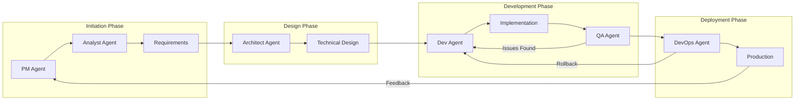

# BMAD Agent Workflow for flutter_keycheck

## 🔄 Master Workflow Diagram



## 📋 Agent Interaction Workflows

### 1️⃣ Dependency Update Workflow

```
[ANALYST]                     [ARCHITECT]                   [DEV]
    │                              │                          │
    ├─ Scan dependencies ─────────>│                          │
    │                              ├─ Review conflicts ──────>│
    │                              │                          ├─ Update pubspec.yaml
    │                              │                          ├─ Resolve conflicts
    │                              │<─────── PR created ──────┤
    │<──── Impact analysis ────────┤                          │
    │                              │                          │
                                                              ▼
                                                         [QA Agent]
                                                              │
                                                              ├─ Run tests
                                                              ├─ Validate
                                                              │
                                                              ▼
                                                         [DEVOPS Agent]
                                                              │
                                                              └─ Deploy
```

### 2️⃣ Story Implementation Workflow

```
[PM Agent]
    │
    ├─ Create Story
    ├─ Assign Priority
    └─ Set Sprint
         │
         ▼
[ANALYST Agent]
    │
    ├─ Requirements Analysis
    ├─ Impact Assessment
    └─ Documentation
         │
         ▼
[ARCHITECT Agent]
    │
    ├─ Technical Design
    ├─ Pattern Selection
    └─ Review Architecture
         │
         ▼
[DEV Agent]
    │
    ├─ Implementation
    ├─ Unit Tests
    └─ Code Review
         │
         ▼
[QA Agent]
    │
    ├─ Integration Tests
    ├─ E2E Tests
    └─ Performance Tests
         │
         ▼
[DEVOPS Agent]
    │
    ├─ CI/CD Pipeline
    ├─ Deployment
    └─ Monitoring
```

### 3️⃣ Bug Fix Workflow

```
Issue Detected
      │
      ▼
[QA Agent] ──────> Bug Report
      │                 │
      │                 ▼
      │          [ANALYST Agent]
      │                 │
      │                 ├─ Root Cause Analysis
      │                 ├─ Impact Assessment
      │                 │
      │                 ▼
      │          [DEV Agent]
      │                 │
      │                 ├─ Fix Implementation
      │                 ├─ Unit Test
      │                 │
      └─────────────────┤
                        │
                        ▼
                  Regression Test
                        │
                        ▼
                 [DEVOPS Agent]
                        │
                        └─ Hotfix Deploy
```

## 🎯 Scenario-Based Workflows

### Scenario 1: Architecture Review
```bash
# Command sequence
bmad architect              # Review current architecture
bmad analyst                # Analyze metrics
bmad dev analyze            # Static analysis
bmad qa test                # Run tests
```

### Scenario 2: Release Preparation
```bash
# Command sequence
bmad pm                     # Check sprint status
bmad dev format             # Format code
bmad dev analyze            # Analyze code
bmad qa coverage            # Check test coverage
bmad devops publish-dry    # Dry run publish
```

### Scenario 3: Performance Optimization
```bash
# Command sequence
bmad analyst                # Get baseline metrics
bmad architect              # Review bottlenecks
bmad dev build              # Build optimized version
bmad qa integration         # Performance tests
```

## 🤝 Agent Communication Protocol

### Message Format
```json
{
  "from": "ANALYST",
  "to": "ARCHITECT",
  "type": "ANALYSIS_COMPLETE",
  "payload": {
    "dependencies": {
      "outdated": 9,
      "conflicts": 2
    },
    "recommendation": "Major version upgrade needed"
  },
  "timestamp": "2024-12-29T15:40:00Z"
}
```

### Event Types
- `ANALYSIS_COMPLETE` - Analysis finished
- `DESIGN_APPROVED` - Design reviewed
- `CODE_READY` - Implementation complete
- `TESTS_PASSED` - All tests passing
- `DEPLOY_SUCCESS` - Deployment successful
- `ISSUE_FOUND` - Problem detected
- `ROLLBACK_REQUIRED` - Revert needed

## 🔧 Integration Commands

### Claude Code Integration
```bash
# In Claude Code, you can now use:
source scripts/bmad_commands.sh

# Then run BMAD commands:
bmad analyst           # Run analysis
bmad dev format        # Format code
bmad qa test           # Run tests
bmad all               # Run all agents
```

### Automated Workflows
```bash
# Development workflow
bmad dev format && bmad dev analyze && bmad qa test

# Release workflow
bmad devops ci-local && bmad devops publish-dry

# Full analysis
bmad all
```

## 📊 Workflow Metrics

### Success Criteria
- **Analysis Phase**: < 5 minutes
- **Design Review**: < 30 minutes
- **Implementation**: Per story points
- **Testing**: > 80% coverage
- **Deployment**: < 10 minutes

### Quality Gates
1. **Code Quality**: No critical issues
2. **Test Coverage**: > 80%
3. **Performance**: < 30s scan time
4. **Documentation**: Updated
5. **Dependencies**: All resolved

## 🚀 Quick Start

1. **Load BMAD Commands**
   ```bash
   source scripts/bmad_commands.sh
   ```

2. **Run Initial Analysis**
   ```bash
   bmad all
   ```

3. **Start Development**
   ```bash
   bmad dev format
   bmad dev analyze
   ```

4. **Test Changes**
   ```bash
   bmad qa test
   ```

5. **Prepare Release**
   ```bash
   bmad devops ci-local
   ```

## 📈 Continuous Improvement

### Feedback Loop
```
Deploy → Monitor → Analyze → Improve → Test → Deploy
```

### Optimization Opportunities
- Parallel agent execution
- Automated decision making
- ML-based predictions
- Real-time monitoring
- Self-healing workflows

## 🎓 Best Practices

1. **Always run analysis first** - `bmad analyst`
2. **Format before commit** - `bmad dev format`
3. **Test after changes** - `bmad qa test`
4. **Review architecture regularly** - `bmad architect`
5. **Track sprint progress** - `bmad pm`