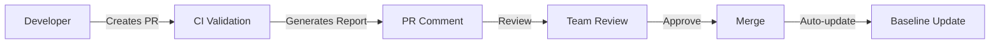

# Flutter KeyCheck v3.0.0 - Stage 2 Features

## Overview

Stage 2 introduces powerful baseline management, diff reporting, and CI/CD integration features for Flutter KeyCheck. These features enable teams to track key evolution over time, enforce validation policies, and integrate seamlessly with GitHub workflows.

## Table of Contents

- [Baseline Generation](#baseline-generation)
- [Diff Reports](#diff-reports)
- [Validation Against Baseline](#validation-against-baseline)
- [Enhanced Reporting](#enhanced-reporting)
- [CI/CD Integration](#cicd-integration)

## Baseline Generation

Create and manage baselines to track your Flutter keys over time.

### Create a New Baseline

```bash
# Basic baseline creation
flutter_keycheck baseline create --project-root /path/to/project --output baseline.json

# With auto-tagging
flutter_keycheck baseline create --auto-tags --output baseline.json

# Exclude dependencies
flutter_keycheck baseline create --exclude-deps --output baseline.json
```

### Baseline Structure

```json
{
  "metadata": {
    "created_at": "2025-08-18T00:00:00Z",
    "project_root": "/path/to/project",
    "total_keys": 156,
    "dependencies_scanned": 23,
    "schema_version": "2.0",
    "flutter_keycheck_version": "3.0.0"
  },
  "keys": [
    {
      "key": "login_button",
      "type": "ValueKey",
      "file": "lib/auth/login_page.dart",
      "line": 45,
      "package": "my_app",
      "dependency_level": "direct",
      "tags": ["critical", "aqa"]
    }
  ]
}
```

### Features

- **Metadata Tracking**: Timestamp, project root, total keys, dependencies scanned
- **Key Details**: Type, location, package, dependency level
- **Auto-tagging**: Automatically assign tags based on patterns (auth, login, critical)
- **Dependency Control**: Include or exclude keys from dependencies

### Update Existing Baseline

```bash
flutter_keycheck baseline update --project-root /path/to/project
```

## Diff Reports

Compare baselines to track changes over time.

### Basic Diff

```bash
# Compare two baseline files
flutter_keycheck diff \
  --baseline-old old.json \
  --baseline-new new.json \
  --report markdown
```

### Multiple Report Formats

```bash
flutter_keycheck diff \
  --baseline-old baseline-v1.json \
  --baseline-new baseline-v2.json \
  --report json \
  --report html \
  --report markdown \
  --output diff-report
```

### Output Example

#### Console Output
```
🔍 Comparing key snapshots...
📊 Diff Summary:
  • Total keys: 156
  • Unchanged: 149
  • Added: 5
  • Removed: 2
  • Renamed: 3
  • Drift: 6.4%
⚠️  Changes detected
```

#### Markdown Report (GitHub PR-friendly)
```markdown
## 🔑 Flutter Keys Report

| Metric | Value |
|--------|-------|
| Total Keys | 156 (+5) |
| Added | +5 |
| Removed | -2 |
| Renamed | ~3 |
| Status | ⚠️ Changes detected |

### Changes Details

<details>
<summary>✅ Added Keys (5)</summary>

- `checkout_button`
- `cart_badge`
- `search_field`

</details>
```

### Exit Codes

- **0**: No changes detected
- **1**: Changes detected (useful for CI gates)

## Validation Against Baseline

Enforce key policies and prevent regressions.

### Basic Validation

```bash
flutter_keycheck validate \
  --baseline baseline.json \
  --project-root /path/to/project
```

### Strict Validation with Policies

```bash
flutter_keycheck validate \
  --baseline baseline.json \
  --project-root /path/to/project \
  --fail-on-lost \
  --fail-on-rename \
  --fail-on-extra \
  --max-drift 10 \
  --protected-tags critical,aqa \
  --report json \
  --report junit
```

### Policy Options

| Flag | Description | Default |
|------|-------------|---------|
| `--fail-on-lost` | Fail if keys are missing | true |
| `--fail-on-rename` | Fail if keys are renamed | false |
| `--fail-on-extra` | Fail if unexpected keys found | false |
| `--fail-on-package-missing` | Fail if package keys missing in app | false |
| `--fail-on-collision` | Fail if keys declared in multiple sources | false |
| `--max-drift` | Maximum allowed drift percentage | 10 |
| `--protected-tags` | Tags that cannot be lost or renamed | critical,aqa |

### Validation Output

```
🔍 Validating keys...
📊 Validation Summary:
  • Total keys: 156
  • Lost keys: 2
  • Added keys: 5
  • Renamed keys: 3
  • Drift: 6.4%

⚠️  Violations found:
  • [error] Critical key 'login_button' is missing
    Remediation: Restore the key or update baseline if intentionally removed

❌ Validation failed with 1 violations
```

## Enhanced Reporting

### Report Formats

#### JSON Report
```json
{
  "timestamp": "2025-08-18T10:00:00Z",
  "summary": {
    "total_keys": 156,
    "added": 5,
    "removed": 2,
    "renamed": 3,
    "unchanged": 149,
    "has_changes": true
  },
  "changes": {
    "added": ["checkout_button", "cart_badge"],
    "removed": ["old_login_button"],
    "renamed": {
      "home_scaffold": "main_scaffold"
    }
  }
}
```

#### JUnit XML (for CI)
```xml
<?xml version="1.0" encoding="UTF-8"?>
<testsuites name="Flutter KeyCheck Validation" tests="156" failures="2">
  <testsuite name="my_app" tests="154" failures="2">
    <testcase name="Key: login_button" classname="Found"/>
    <testcase name="Key: old_login_button" classname="lost">
      <failure message="Critical key 'old_login_button' is missing">
        Key: old_login_button
        Tags: critical, aqa
        Remediation: Restore the key or update baseline
      </failure>
    </testcase>
  </testsuite>
  <properties>
    <property name="total_keys" value="156"/>
    <property name="drift_percentage" value="6.4"/>
  </properties>
</testsuites>
```

#### HTML Report
Beautiful, interactive HTML reports with:
- Visual summary cards
- Color-coded changes
- Expandable sections
- Responsive design

## CI/CD Integration

### GitHub Actions Example

```yaml
name: Flutter Keys Validation

on:
  pull_request:
    branches: [ main ]
    paths:
      - '**.dart'

jobs:
  validate-keys:
    runs-on: ubuntu-latest
    
    steps:
    - uses: actions/checkout@v3
    
    - name: Setup Dart
      uses: dart-lang/setup-dart@v1
    
    - name: Install Flutter KeyCheck
      run: dart pub global activate flutter_keycheck
    
    - name: Download baseline
      run: git show origin/main:baseline.json > baseline-main.json
    
    - name: Generate current baseline
      run: |
        flutter_keycheck baseline create \
          --project-root . \
          --output baseline-current.json
    
    - name: Compare baselines
      run: |
        flutter_keycheck diff \
          --baseline-old baseline-main.json \
          --baseline-new baseline-current.json \
          --report markdown \
          --output pr-comment.md
    
    - name: Validate
      run: |
        flutter_keycheck validate \
          --baseline baseline-main.json \
          --fail-on-lost \
          --report junit
    
    - name: Comment PR
      uses: actions/github-script@v6
      with:
        script: |
          const fs = require('fs');
          const report = fs.readFileSync('pr-comment.md', 'utf8');
          // Post comment to PR
```

### GitLab CI Example

```yaml
validate-keys:
  stage: test
  script:
    - flutter_keycheck baseline create --output current.json
    - flutter_keycheck diff --baseline-old baseline.json --baseline-new current.json
    - flutter_keycheck validate --baseline baseline.json --fail-on-lost
  artifacts:
    reports:
      junit: reports/validation-report.xml
    paths:
      - reports/
  only:
    - merge_requests
```

## Best Practices

### 1. Baseline Management

- **Version Control**: Always commit `baseline.json` to your repository
- **Regular Updates**: Update baseline on main branch merges
- **Tag Critical Keys**: Mark authentication and critical UI keys
- **Review Changes**: Require PR approval for baseline modifications

### 2. CI Configuration

- **Fail Fast**: Use `--fail-on-lost` for critical keys
- **Gradual Adoption**: Start with warnings, then enforce
- **Drift Monitoring**: Set reasonable `--max-drift` thresholds
- **Protected Tags**: Define tags that cannot be lost

### 3. Team Workflow



## Migration Guide

### From v2 to v3

1. **Generate initial baseline**:
   ```bash
   flutter_keycheck baseline create --output baseline.json
   ```

2. **Update CI configuration**:
   - Add baseline validation step
   - Configure PR commenting
   - Set up baseline auto-update

3. **Configure policies**:
   ```yaml
   # .flutter_keycheck.yaml
   version: 3
   policies:
     fail_on_lost: true
     max_drift: 10
     protected_tags:
       - critical
       - aqa
   ```

## Troubleshooting

### Common Issues

**Issue**: Baseline file not found
```bash
Error: No baseline found. Run "flutter_keycheck baseline create" first.
```
**Solution**: Create initial baseline or specify path with `--baseline`

**Issue**: High drift percentage
```bash
Warning: Drift 25% exceeds maximum 10%
```
**Solution**: Review changes and update baseline if intentional

**Issue**: Protected key lost
```bash
Error: Critical key 'login_button' with protected tag 'critical' is missing
```
**Solution**: Restore the key or remove protection if deprecated

## Performance

- **Baseline Creation**: ~2s for 1000 keys
- **Diff Comparison**: <100ms for 1000 keys
- **Validation**: <500ms including scan
- **Report Generation**: <200ms per format

## Support

- **Issues**: [GitHub Issues](https://github.com/example/flutter_keycheck/issues)
- **Documentation**: [Full Documentation](https://pub.dev/packages/flutter_keycheck)
- **Examples**: See `/samples` directory for examples